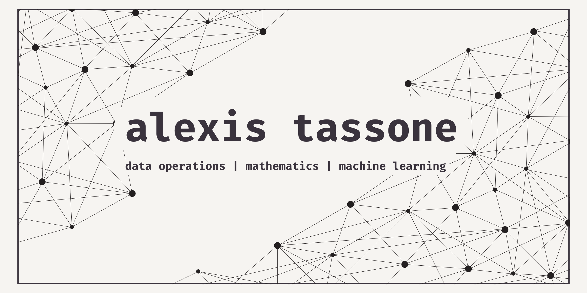

  
  
  # 🏛️ Alexis Tassone
  **Technical Analyst | Mathematics & Statistics Specialist**
  
  *Bridging the gap between analytical rigour and humanitarian impact.*

---

### 🖋️ Profile
I am a technical analyst driven by the intersection of **NLP, Computer Vision, and Humanitarian Impact.** With a background in Mathematics from the University of Toronto, I focus on turning complex, messy data into structured insights that solve human-centric problems. I believe that data is most powerful when it is accurate, well-structured, and used to better people's lives.

* **Current Role:** Junior Data Operations Analyst at **Citylitics**, supporting data quality for infrastructure and public-impact datasets.
* **Core Philosophy:** High accuracy and documentation rigour are the bedrock of reliable AI.
* **Technical Mission:** Leveraging analytical rigour to build models that solve human-centric problems.

---

### 🛠️ Technical Arsenal
| Category | Stack |
| :--- | :--- |
| **Mathematics** | Probability, Statistics, Graph Theory, Stochastic Processes |
| **Languages** | Python (PyTorch, pandas, scikit-learn), SQL, R, LaTeX |
| **Data Ops** | Data Governance, NLP Preprocessing, Validation Pipelines |
| **Tools** | Power BI, Power Query, Excel, Git |

---

### 📂 Selected Academic Research & Analysis
* **Mental Health Tweets Analysis** — Developed PyTorch models to classify tweet patterns, applying NLP to identify mental-health-related trends.
* **Student Performance Prediction** — Implemented k-NN and Item Response Theory (IRT) to predict student performance with ~68% accuracy.
* **Twitch Gaming SQL Analytics** — Queried 800,000+ rows of streaming data to analyze viewer behaviour and engagement trends.

---

### 🧪 Currently Learning & Exploring
* **DeepLearning.AI:** Completing the Machine Learning Specialization to bridge the gap between data ops and model architecture.
* **Humanitarian Tech:** Exploring how NLP can better categorize aid-related information in crisis zones.
* **Computer Vision:** Investigating the use of CV for identifying infrastructure needs in public-impact datasets.
* **Formula for Progress:** $$\text{Insight} = \int (\text{Data} + \text{Context}) \, d\text{Humanity}$$

---

### 📊 Technical Proficiencies

---

### ☕ Connect With Me
* [LinkedIn](https://linkedin.com/in/alexis-tassone)
* **Email:** alexisjtassone@gmail.com
